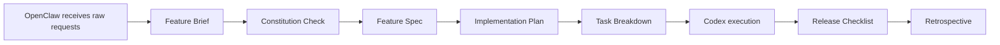

# OpenClaw + Codex Product OS Seed

A Git seed project for end-to-end product development.

中文入口: [README.md](README.md)

This repository turns `OpenClaw + Codex` into a reusable product development operating system so that intake, specification, planning, tasking, implementation, verification, release, and retrospectives live in one place.

## Language Rules

- Paths, filenames, slugs, variables, commands, and scripts use English
- Template headings and fixed field names use English
- Descriptive prose defaults to Chinese, with English document variants provided
- Real project artifacts stay single-source, such as `brief.md`
- Real project artifact body text may be written in Chinese or English

See:

- Chinese: [docs/language-policy.cn.md](docs/language-policy.cn.md)
- English: [docs/language-policy.en.md](docs/language-policy.en.md)

## Workflow



## Quick Start

```bash
make new-feature SLUG=improve-onboarding LANG=en
```

Or:

```bash
make new-feature SLUG=improve-onboarding LANG=cn
```

Both commands generate the same standard artifact names:

- `specs/features/improve-onboarding/brief.md`
- `specs/features/improve-onboarding/spec.md`
- `specs/features/improve-onboarding/plan.md`
- `specs/features/improve-onboarding/tasks.md`

Only the template prose changes by language.

Run validation locally:

```bash
make validate-specs
```

## Entry Points

- [docs/execution-playbook.en.md](docs/execution-playbook.en.md)
- [docs/product-rd-operating-system.en.md](docs/product-rd-operating-system.en.md)
- [docs/seed-project-guide.en.md](docs/seed-project-guide.en.md)
- [docs/language-policy.en.md](docs/language-policy.en.md)
- [specs/constitution.en.md](specs/constitution.en.md)
- [examples/onboarding-improvement/brief.md](examples/onboarding-improvement/brief.md)

## License

MIT, see [LICENSE](LICENSE).
