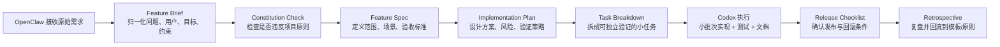

# OpenClaw + Codex Product OS Seed

一个面向产品研发全流程的 Git 种子项目。

English: [README.en.md](README.en.md)

它的目标不是“更快地产生代码”，而是把 `OpenClaw + Codex` 组织成一套可以长期复用、持续演进的研发操作系统，让需求进入、规格澄清、计划制定、任务拆解、实现验证、发布复盘都留在同一个仓库里。

## 语言规则

- 路径、文件名、slug、变量、命令、脚本名全部使用英文
- 模板的章节标题和固定字段名全部使用英文
- 描述性正文默认中文，同时提供英文版文档和模板
- 实际项目工件只保留单份标准文件名，例如 `brief.md`
- 实际项目工件正文可以按用户习惯使用中文或英文

详细规则见：

- 中文版：[docs/language-policy.cn.md](docs/language-policy.cn.md)
- English: [docs/language-policy.en.md](docs/language-policy.en.md)

## 方法总览

- `OpenClaw`：需求入口、协作入口、编排入口
- `Codex`：仓库内的执行代理
- `XP`：小步快跑、测试优先、持续重构
- `SDD`：先规格，后实现
- `Spec-Kit`：适合新能力或大功能的规格化启动
- `OpenSpec`：适合已有产品的持续变更管理
- `Superpowers`：强化 brainstorm、plan、execute、verify 的执行纪律

## 协作流程



## 仓库结构

```text
.
├── README.md
├── README.en.md
├── docs/
│   ├── language-policy.cn.md
│   ├── language-policy.en.md
│   ├── execution-playbook.cn.md
│   ├── execution-playbook.en.md
│   ├── product-rd-operating-system.cn.md
│   ├── product-rd-operating-system.en.md
│   ├── seed-project-guide.cn.md
│   └── seed-project-guide.en.md
├── examples/
│   └── onboarding-improvement/
├── scripts/
├── specs/
│   ├── constitution.cn.md
│   ├── constitution.en.md
│   ├── features/
│   └── releases/
└── templates/
    ├── *.cn.md
    └── *.en.md
```

## 快速开始

### 1. 使用种子项目

- 直接从这个仓库创建新仓库
- 或者 `Use this template`
- 或者 clone 后再推到自己的项目仓库

### 2. 初始化一个功能工作区

```bash
make new-feature SLUG=improve-onboarding LANG=cn
```

或：

```bash
make new-feature SLUG=improve-onboarding LANG=en
```

这两种方式都会生成同一套标准工件名：

- `specs/features/improve-onboarding/brief.md`
- `specs/features/improve-onboarding/spec.md`
- `specs/features/improve-onboarding/plan.md`
- `specs/features/improve-onboarding/tasks.md`

区别只在于工件正文提示语来自中文模板还是英文模板。

### 3. 本地校验

```bash
make validate-specs
```

当前会检查：

- `specs/features/<slug>/` 是否存在 `brief.md`
- `specs/features/<slug>/` 是否存在 `spec.md`
- `specs/features/<slug>/` 是否存在 `plan.md`
- `specs/features/<slug>/` 是否存在 `tasks.md`
- 这些文件是否仍然保留标准英文结构标题

## 文档入口

- 操作系统总纲：[docs/product-rd-operating-system.cn.md](docs/product-rd-operating-system.cn.md)
- 执行手册：[docs/execution-playbook.cn.md](docs/execution-playbook.cn.md)
- 种子项目用法：[docs/seed-project-guide.cn.md](docs/seed-project-guide.cn.md)
- 语言策略：[docs/language-policy.cn.md](docs/language-policy.cn.md)
- 项目原则：[specs/constitution.cn.md](specs/constitution.cn.md)
- 端到端示例：[examples/onboarding-improvement/brief.md](examples/onboarding-improvement/brief.md)

英文入口：

- [README.en.md](README.en.md)
- [docs/execution-playbook.en.md](docs/execution-playbook.en.md)
- [docs/product-rd-operating-system.en.md](docs/product-rd-operating-system.en.md)
- [docs/seed-project-guide.en.md](docs/seed-project-guide.en.md)
- [docs/language-policy.en.md](docs/language-policy.en.md)
- [specs/constitution.en.md](specs/constitution.en.md)

## 图片规则

本仓库默认优先使用 Mermaid 图来表达流程。

如果后续确实需要用生图模型生成图片，规则如下：

- 生成后必须做二次确认
- 只有在图片准确表达初衷时才纳入仓库
- 若图片存在歧义，优先回退到 Mermaid 或文字说明

## License

本项目默认使用 MIT License，见 [LICENSE](LICENSE)。
