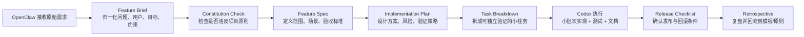
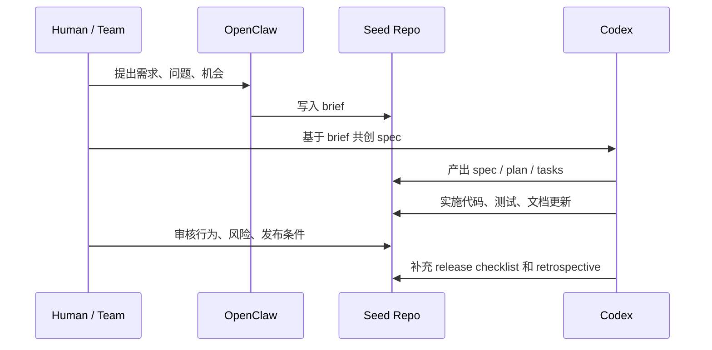

# OpenClaw + Codex Product OS Seed

一个面向产品研发全流程的 Git 种子项目。

它的目标不是“更快地产生代码”，而是把 `OpenClaw + Codex` 组织成一套可以长期复用、持续演进的研发操作系统，让需求进入、规格澄清、计划制定、任务拆解、实现验证、发布复盘都留在同一个仓库里。

适用场景：

- 你想让新项目从第一天就按统一流程运转
- 你希望产品、研发、AI agent 在同一套工件上协作
- 你要把 `XP + SDD + Spec-Kit + OpenSpec + Superpowers` 融成一条稳定流水线

## 它解决什么问题

很多团队的问题不是没有工具，而是这些工具各自工作：

- 需求在聊天里，后续无法追踪
- 设计在脑子里，改动无法审计
- 开发直接上手写代码，导致返工
- AI 能写代码，但不能稳定继承团队方法
- 不同项目的协作方式不一致，复盘也无法回流

这个 seed repo 的作用，就是先把“研发方法”固化成仓库结构、模板和约定，然后让每个新项目都站在同一个起点上。

## 方法总览

- `OpenClaw`：需求入口、协作入口、编排入口
- `Codex`：仓库内的执行代理
- `XP`：小步快跑、测试优先、持续重构
- `SDD`：先规格，后实现
- `Spec-Kit`：适合新能力或大功能的规格化启动
- `OpenSpec`：适合已有产品的持续变更管理
- `Superpowers`：强化 brainstorm、plan、execute、verify 的执行纪律

## 协作流程



这条链路里，`规格` 不是附件，而是主干。

## 仓库结构

```text
.
├── README.md
├── CHANGELOG.md
├── LICENSE
├── Makefile
├── docs/
│   ├── product-rd-operating-system.md
│   └── seed-project-guide.md
├── scripts/
│   └── new-feature.sh
├── specs/
│   ├── constitution.md
│   ├── features/
│   └── releases/
└── templates/
    ├── feature-brief.md
    ├── feature-spec.md
    ├── implementation-plan.md
    ├── task-breakdown.md
    ├── release-checklist.md
    └── iteration-retrospective.md
```

## 一次完整协作是什么样的



## 现在已经可执行到什么程度

当前状态：

- 已经是“可执行的人类+Agent 协作流程”
- 已经是“可复用的 Git seed 项目”
- 还不是“全自动化工作流平台”

已经具备：

- 生命周期总纲
- 项目原则治理
- 全套规格与交付模板
- 新功能脚手架脚本
- GitHub Actions spec 工件校验
- GitHub issue / PR 模板
- 可直接作为 GitHub 仓库发布的基础结构

暂时还没有：

- OpenClaw 的专用命令封装
- seed 仓库对下游项目的自动同步机制

## 快速开始

### 1. 复制这个 seed repo

你可以：

- 直接从这个仓库创建新仓库
- 或者 `Use this template`
- 或者 clone 后再推到自己的项目仓库

### 2. 初始化一个功能工作区

```bash
make new-feature SLUG=improve-onboarding
```

这会创建：

- `specs/features/improve-onboarding/brief.md`
- `specs/features/improve-onboarding/spec.md`
- `specs/features/improve-onboarding/plan.md`
- `specs/features/improve-onboarding/tasks.md`

### 3. 按顺序推进

1. 先填 `brief.md`
2. 再写 `spec.md`
3. 再落 `plan.md`
4. 再拆 `tasks.md`
5. 再让 Codex 进入实现与验证

### 4. 本地先跑一次 spec 校验

```bash
make validate-specs
```

这个校验和 GitHub Actions 使用同一套规则，当前会检查：

- `specs/features/<slug>/` 是否存在 `brief.md`
- `specs/features/<slug>/` 是否存在 `spec.md`
- `specs/features/<slug>/` 是否存在 `plan.md`
- `specs/features/<slug>/` 是否存在 `tasks.md`
- 上述文件中是否包含关键章节标题

## 默认工作约定

- 用户可见行为变化，必须先更新 spec
- 大改动先出 plan，再进入实现
- 每个任务都必须绑定验证方式
- 发布前必须填写 release checklist
- 同类摩擦重复出现，就更新模板或 constitution

## 文档入口

- 操作系统总纲：[docs/product-rd-operating-system.md](docs/product-rd-operating-system.md)
- 种子项目用法：[docs/seed-project-guide.md](docs/seed-project-guide.md)
- 项目原则：[specs/constitution.md](specs/constitution.md)

## 关于图片与图示

本仓库默认优先使用 Mermaid 图来表达流程，因为它：

- 易维护
- 可版本化
- 能随文本一起演化

如果后续确实需要用生图模型生成图片，新增规则如下：

- 生成后必须做二次确认
- 只有在图片准确表达初衷时才纳入仓库
- 若图片存在歧义，优先回退到 Mermaid 或文字说明

## 后续推荐增强

- 增加 release note 自动生成
- 增加 seed 升级同步策略

## License

本项目默认使用 MIT License，见 [LICENSE](LICENSE)。
