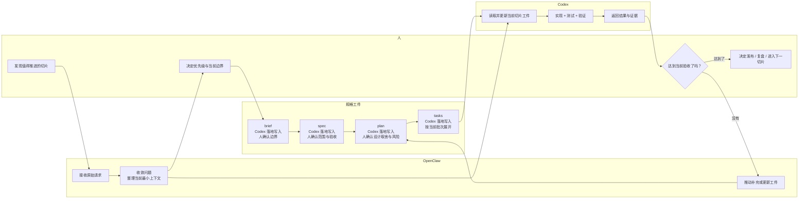
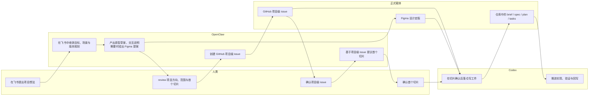
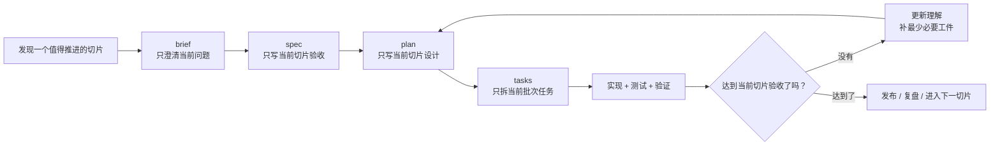

# OpenClaw + Codex Product OS Seed

一个面向产品研发全流程的 Git 种子项目。

它的目标不是“更快地产生代码”，而是把 `OpenClaw + Codex` 组织成一套符合敏捷价值观、吸收 XP 习惯、并用 SDD 管理交付证据的研发操作系统。

## 语言规则

- 路径、文件名、slug、变量、命令、脚本名全部使用英文
- 说明性内容统一使用中文
- 实际项目工件只保留单份标准文件名，例如 `brief.md`
- 等规则稳定后，再统一翻译英文版本

详细规则见：[docs/04-governance/language-policy.md](docs/04-governance/language-policy.md)

## 方法总览

- `OpenClaw`：需求入口、协作入口、编排入口
- `Codex`：仓库内的执行代理
- `XP`：小步快跑、测试优先、持续重构
- `SDD`：先规格，后实现
- `Spec-Kit`：适合新能力或大功能的规格化启动
- `OpenSpec`：适合已有产品的持续变更管理
- `Superpowers`：强化 brainstorm、plan、execute、verify 的执行纪律

## 系统边界

- 飞书：人类与 `OpenClaw` 的主协作界面
- GitHub：正式项目入口和正式工件入口
- Figma：设计定版来源
- 仓库中的 `brief / spec / plan / tasks`：切片级执行载体

## 运行形态

- 人类：主要与 `OpenClaw` 交互
- `OpenClaw`：固定扮演前台编排者，负责收敛、分派、回传和审批网关控制
- `Codex`：固定扮演后台执行者，负责技术分析、规格落仓、实现、测试、验证和证据整理
- 设计师、架构师、QA、产品、工程等岗位：先抽象成职责簇，由这三固定角色承担

## 这套 spec 主要给谁用

这套工件不是只给产品或只给工程写的，而是给同一条交付链路上的三类参与者共同使用：

- 人：负责取舍、优先级、风险和发布决策
- `OpenClaw`：负责接收原始请求、收敛问题、组织协作入口
- `Codex`：负责读取当前切片工件、执行实现、验证结果并产出证据

因此，这套 `brief / spec / plan / tasks` 的目标不是“写文档归档”，而是让不同角色围绕同一个当前切片协作。

这些规格文件也是三方协作的结果：

- 人负责决定当前切片边界、验收标准、风险取舍和是否进入下一步
- `OpenClaw` 负责把原始请求收敛成可进入仓库流程的问题，并推动补齐当前需要的工件
- `Codex` 负责把这些决策和边界落实到 `brief / spec / plan / tasks` 中，并在实现过程中持续更新

因此，规格文件通常由 `Codex` 落地写入，但规格内容的最终责任仍然在人的决策。

## 我们遵循的思想

- 敏捷：优先交付小而真实的价值，而不是追求一次性完整定义
- XP：小步快跑、快速反馈、测试优先、持续重构
- SDD：先澄清为什么做、做什么、怎么验证，再进入实现
- 面向 `Codex` 的最小上下文：只提供当前切片所需信息，降低理解和执行成本
- 最后责任时刻：高成本决定尽量延后到必须决定的时候

## 它和瀑布开发有什么区别

瀑布式开发倾向于先完整分析、完整设计、完整拆解，再统一开发和验收。

这套方法强调的是：

- 只定义当前切片，不一次覆盖整个主题
- 每个切片都要独立验收，不等“大版本完成”
- 设计只服务当前切片，不为未来切片预支复杂度
- 理解变化时先更新工件，再继续实现

## 多角色协作流程



## 项目启动流程



## 切片主循环



## 仓库结构

```text
.
├── README.md
├── capabilities/
│   └── <capability-slug>/
├── docs/
│   ├── 01-mainline/
│   ├── 02-openclaw/
│   ├── 03-codex/
│   ├── 04-governance/
│   └── 05-seed-usage/
├── examples/
│   └── onboarding-improvement/
├── scripts/
├── specs/
│   ├── constitution.md
│   ├── features/
│   └── releases/
└── templates/
    └── *.md
```

## 快速开始

### 1. 使用种子项目

- 直接从这个仓库创建新仓库
- 或者 `Use this template`
- 或者 clone 后再推到自己的项目仓库

### 2. 初始化一个功能工作区

```bash
make new-feature SLUG=improve-onboarding
```

会生成同一套标准工件名：

- `specs/features/improve-onboarding/brief.md`
- `specs/features/improve-onboarding/spec.md`
- `specs/features/improve-onboarding/plan.md`
- `specs/features/improve-onboarding/tasks.md`

这些工件只服务于当前切片，不要求一次覆盖整个主题。

### 3. 本地校验

```bash
make validate-specs
```

当前会检查：

- `specs/features/<slug>/` 是否存在 `brief.md`
- `specs/features/<slug>/` 是否存在 `spec.md`
- `specs/features/<slug>/` 是否存在 `plan.md`
- `specs/features/<slug>/` 是否存在 `tasks.md`
- 这些文件是否保持标准中文章节结构

## 文档入口

- 文档总入口：[docs/README.md](docs/README.md)
- 主线总览：[docs/01-mainline/overview.md](docs/01-mainline/overview.md)
- 项目启动：[docs/01-mainline/project-start.md](docs/01-mainline/project-start.md)
- 切片执行：[docs/01-mainline/slice-execution.md](docs/01-mainline/slice-execution.md)
- 角色模型：[docs/01-mainline/roles-and-operating-model.md](docs/01-mainline/roles-and-operating-model.md)
- 审批与回流：[docs/01-mainline/approval-and-feedback.md](docs/01-mainline/approval-and-feedback.md)
- OpenClaw Backlog：[docs/02-openclaw/backlog.md](docs/02-openclaw/backlog.md)
- OpenClaw 能力包规范：[docs/02-openclaw/capability-pack-spec.md](docs/02-openclaw/capability-pack-spec.md)
- Codex 能力基线：[docs/03-codex/capability-baseline.md](docs/03-codex/capability-baseline.md)
- Codex Backlog：[docs/03-codex/backlog.md](docs/03-codex/backlog.md)
- Codex Skill 手册：[docs/03-codex/skill-sourcing-playbook.md](docs/03-codex/skill-sourcing-playbook.md)
- 切片质量检查清单：[docs/04-governance/slice-quality-checklist.md](docs/04-governance/slice-quality-checklist.md)
- 语言策略：[docs/04-governance/language-policy.md](docs/04-governance/language-policy.md)
- 术语表：[docs/04-governance/glossary.md](docs/04-governance/glossary.md)
- 种子项目用法：[docs/05-seed-usage/seed-project-guide.md](docs/05-seed-usage/seed-project-guide.md)
- 项目原则：[specs/constitution.md](specs/constitution.md)
- 迭代式示例：[examples/onboarding-improvement/README.md](examples/onboarding-improvement/README.md)

## 图片规则

本仓库默认优先使用 Mermaid 图来表达流程。

如果后续确实需要用生图模型生成图片，规则如下：

- 生成后必须做二次确认
- 只有在图片准确表达初衷时才纳入仓库
- 若图片存在歧义，优先回退到 Mermaid 或文字说明

## License

本项目默认使用 MIT License，见 [LICENSE](LICENSE)。
