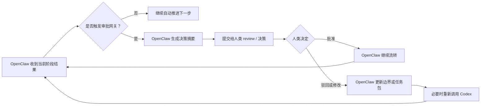

# 审批网关模型

## 目标

定义 `OpenClaw` 在什么情况下可以继续自动推进，什么情况下必须拉人类 review 或决策。

这份模型的作用是：

- 防止 `OpenClaw` 和 `Codex` 无边界自动推进
- 保证人类只在关键节点介入
- 为后续本地 `OpenClaw` 改造提供明确状态机

## 核心原则

- 默认自动推进，直到触发明确网关
- 人类只在关键决策点被拉入
- `OpenClaw` 负责判断是否触发网关
- `Codex` 负责提供触发判断所需的事实、风险和证据

## 审批节点

### 1. 项目启动批准

必须确认：

- 项目目标是否成立
- 是否值得占用当前周期
- 是否进入正式项目级 issue

默认输入：

- 项目草案
- 目标用户与场景
- 版本规划摘要
- 关键风险

### 2. 版本边界批准

必须确认：

- 首版范围是否收敛
- 明确不做是否清楚
- 当前节奏是否可承受

默认输入：

- 首版范围草案
- 范围外清单
- 风险和依赖摘要

### 3. 设计定版批准

必须确认：

- 当前设计是否作为事实来源定版
- Figma 是否可被下游切片消费
- 是否接受当前交互和视觉取舍

默认输入：

- Figma 链接
- 设计摘要
- 可实现性反馈
- 已知设计风险

### 4. 首个切片批准

必须确认：

- 当前切片是否足够小
- 是否有独立用户价值
- 是否有独立验收标准

默认输入：

- 切片建议
- 当前边界与不做事项
- 预期验收
- 风险摘要

### 5. 验收通过批准

必须确认：

- 当前切片是否真的满足验收
- 已知风险是否可接受
- 是否进入下一切片

默认输入：

- 验证证据
- 测试结果
- 已知限制
- 风险摘要

### 6. 发布批准

必须确认：

- 当前版本是否可以发布
- 回滚方式是否可用
- 剩余风险是否可接受

默认输入：

- 发布摘要
- 验证证据
- 回滚方案
- 剩余风险

## 触发条件

出现以下情况时，`OpenClaw` 必须停止自动推进并触发人类介入：

- 项目目标或优先级发生冲突
- 切片边界明显膨胀
- 技术方案改变项目级周期、范围或风险
- 设计定版与实现约束冲突
- 验收失败且需要改变产品边界
- 发布风险超出默认阈值

## 状态机

## OpenClaw 的判断输出

每次触发网关时，`OpenClaw` 应输出固定摘要：

- 当前节点：
- 触发原因：
- 当前建议：
- 可选项：
- 默认建议：
- 不决策会阻塞什么：

## 验收场景

- 当 `Codex` 给出一个只需继续执行的结果时，`OpenClaw` 不会无谓打断人类
- 当切片边界开始膨胀时，`OpenClaw` 能触发“首个切片批准”或重新切片决策
- 当技术方案会影响周期、范围或风险时，`OpenClaw` 能中止自动推进并拉人类拍板
- 当验证通过且剩余风险可控时，`OpenClaw` 能整理成验收摘要而不是转发原始执行细节
