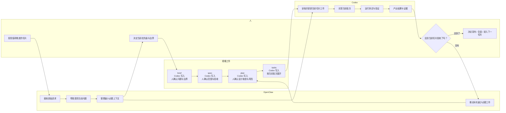
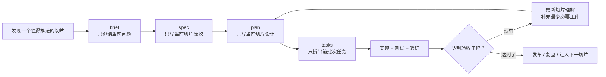

# 产品研发操作系统

## 目标

把 `OpenClaw + Codex` 组织成一套符合敏捷价值观、吸收 XP 习惯、并用 SDD 管理交付证据的研发操作系统。

这不是一条“先把所有规格写完，再统一实现”的直线流程，而是一个持续迭代的回路。

在这套操作系统里，项目级协作与切片级执行是两条不同节奏：

- 项目级协作主要发生在飞书与 GitHub 项目级 issue
- 切片级执行主要发生在仓库中的 `brief / spec / plan / tasks`

## 核心思想

### 1. 规格服务于当前切片，不服务于远期想象

规格不是为了提前写完整，而是为了让当前这一个最小交付切片足够清楚、足够可验证。

### 2. 最后责任时刻再决定

对架构、数据结构、流程细节等高成本决定，尽量延后到必须决定的时刻，但不要晚到影响交付。

### 3. 渐进明细

越接近实现的内容，越具体。

- `brief` 只回答当前为什么值得做
- `spec` 只写当前切片的范围和验收
- `plan` 只写当前切片的设计和风险
- `tasks` 只拆当前批次准备执行的任务

### 4. 小批次验证

每个切片都必须能单独验证，而不是等所有相关需求都完成后再统一验收。

### 5. 只给 `Codex` 必要上下文

每次让 `Codex` 工作时，只给当前切片所需的最小上下文，不把整份大文档、全量背景和未来想法一起塞进去。

## 角色分工

### OpenClaw

- 接收原始需求
- 帮助澄清当前问题
- 把请求送入仓库流程

### Codex

- 读取当前切片所需工件
- 把工件转成实现动作
- 修改代码、运行检查、输出证据

### 人

- 负责取舍
- 决定优先级
- 决定是否到达最后责任时刻
- 对风险和发布负责

## 运行形态

在这套系统里，三者不是平级协作关系，而是固定运行成：

- 人类：主要与 `OpenClaw` 交互
- `OpenClaw`：前台编排者
- `Codex`：后台执行者

这意味着：

- 人类不直接对 `Codex` 下达日常执行指令
- `OpenClaw` 负责“解释、翻译、分派、回传”
- `Codex` 只接收边界清楚的执行任务

更完整的职责映射和交互规则见：[OpenClaw / Codex 操作模型](./openclaw-codex-operating-model.md)

## 规格文件由谁完成

`brief / spec / plan / tasks` 不是某一个角色单独写完的，而是三方协作的结果：

- 人负责内容决策，尤其是当前切片边界、验收标准、风险取舍和是否继续推进
- `OpenClaw` 负责把原始请求收敛成适合进入仓库流程的问题，并推动补齐当前所需工件
- `Codex` 负责把这些决策实际落实到规格文件中，并在实现与验证过程中持续更新

因此，可以把职责理解为：

- 谁决定内容：人
- 谁组织上下文：`OpenClaw`
- 谁落地写入和维护文件：`Codex`

## 系统边界

- 飞书：人类与 `OpenClaw` 的主协作界面，用于项目级讨论与收敛
- GitHub：正式项目入口和正式工件入口
- Figma：设计定版来源
- 仓库工件：当前切片的正式执行载体

这意味着：

- 飞书记录讨论过程，但不是最终事实来源
- GitHub 项目级 issue 负责沉淀项目启动结论
- Figma 负责设计定版
- 仓库只承接已确认切片的执行工件

## 多角色工作流

## 主循环

## 与瀑布式开发的区别

瀑布式开发倾向于先完成全量分析、全量设计、全量任务拆解，再进入集中实现和集中验收。

这里采用的是另一种节奏：

- 只针对当前切片写工件，不一次覆盖整个主题
- 每个切片都要求独立验收和独立反馈
- 设计只解决当前切片必须解决的问题
- 如果理解变化，先更新工件，再继续实现

因此，SDD 在这里不是瀑布化文档流程，而是围绕当前切片组织证据和决策。

## 与 XP 的对应关系

- 小步快跑：切片要小，任务要能独立验证
- 快速反馈：每个切片结束都要得到行为反馈
- 测试优先：能自动验证的行为，尽量先写验证方式
- 持续重构：不把“先堆功能，最后整理”当成默认策略

## 与 SDD 的对应关系

SDD 在这里不是“重文档”，而是“重证据”：

- 为什么做：`brief`
- 做什么：`spec`
- 怎么做：`plan`
- 先做哪一批：`tasks`
- 做到了没有：验证与复盘

## 面向 `Codex` 的规则

- 一个工件只承担一种责任
- 一个对话只处理一个切片或一个批次
- 对 `Codex` 只提供当前必要工件，不提供与当前切片无关的长期设想
- 工件内容优先短句、列表和明确边界，避免大段背景叙述
