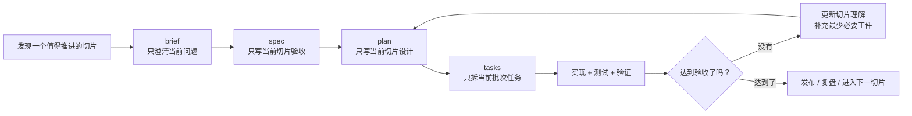

# 产品研发操作系统

## 目标

把 `OpenClaw + Codex` 组织成一套符合敏捷价值观、吸收 XP 习惯、并用 SDD 管理交付证据的研发操作系统。

这不是一条“先把所有规格写完，再统一实现”的直线流程，而是一个持续迭代的回路。

## 核心思想

### 1. 规格服务于当前切片，不服务于远期想象

规格不是为了提前写完整，而是为了让当前这一个最小交付切片足够清楚、足够可验证。

### 2. 最后责任时刻再决定

对架构、数据结构、流程细节等高成本决定，尽量延后到必须决定的时刻，但不要晚到影响交付。

### 3. 渐进明细

越接近实现的内容，越具体。

- `brief` 只回答当前为什么值得做
- `spec` 只写当前切片的范围和验收
- `plan` 只写当前切片的设计和风险
- `tasks` 只拆当前批次准备执行的任务

### 4. 小批次验证

每个切片都必须能单独验证，而不是等所有相关需求都完成后再统一验收。

### 5. AI 只拿必要上下文

每次让 AI 工作时，只给当前切片所需的最小上下文，不把整份大文档、全量背景和未来想法一起塞进去。

## 角色分工

### OpenClaw

- 接收原始需求
- 帮助澄清当前问题
- 把请求送入仓库流程

### Codex

- 读取当前切片所需工件
- 把工件转成实现动作
- 修改代码、运行检查、输出证据

### 人

- 负责取舍
- 决定优先级
- 决定是否到达最后责任时刻
- 对风险和发布负责

## 主循环

## 与 XP 的对应关系

- 小步快跑：切片要小，任务要能独立验证
- 快速反馈：每个切片结束都要得到行为反馈
- 测试优先：能自动验证的行为，尽量先写验证方式
- 持续重构：不把“先堆功能，最后整理”当成默认策略

## 与 SDD 的对应关系

SDD 在这里不是“重文档”，而是“重证据”：

- 为什么做：`brief`
- 做什么：`spec`
- 怎么做：`plan`
- 先做哪一批：`tasks`
- 做到了没有：验证与复盘

## AI 友好规则

- 一个工件只承担一种责任
- 一个对话只处理一个切片或一个批次
- 对 AI 只提供当前必要工件，不提供与当前切片无关的长期设想
- 工件内容优先短句、列表和明确边界，避免大段背景叙述
